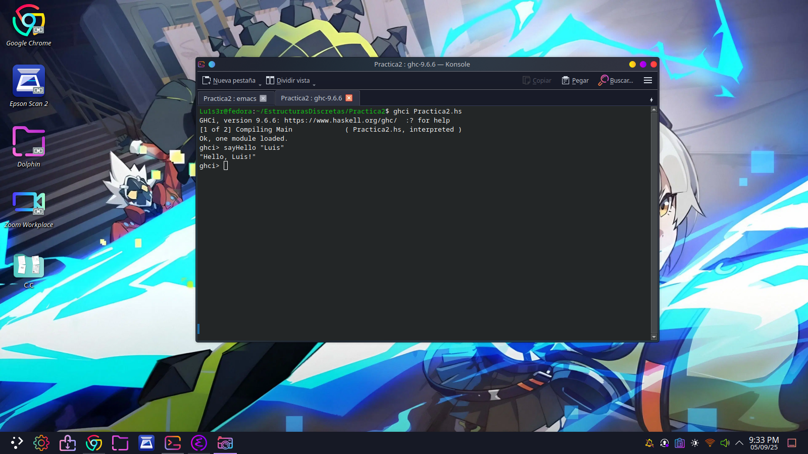

Objetivo de la práctica2:
-Conocer sobre el modo interactivo de Haskell (ghci)
-Implementación de funciones.
-Empezar a familiarizarnos con Haskell junto con todo lo que implica como su sintaxis.

Tiempo en completar la practica:
 Aproximadamente, creo que me tardé en terminar todo como una hora y media, más por los pequeños detalles de errores al escribir las funciones y que al probarlas no daban.

Al final me quedó claro completamente para que son los datos 'Float', 'Double', ya que aún tenía pequeñas dudas sobre ellos, junto con las tuplas.

