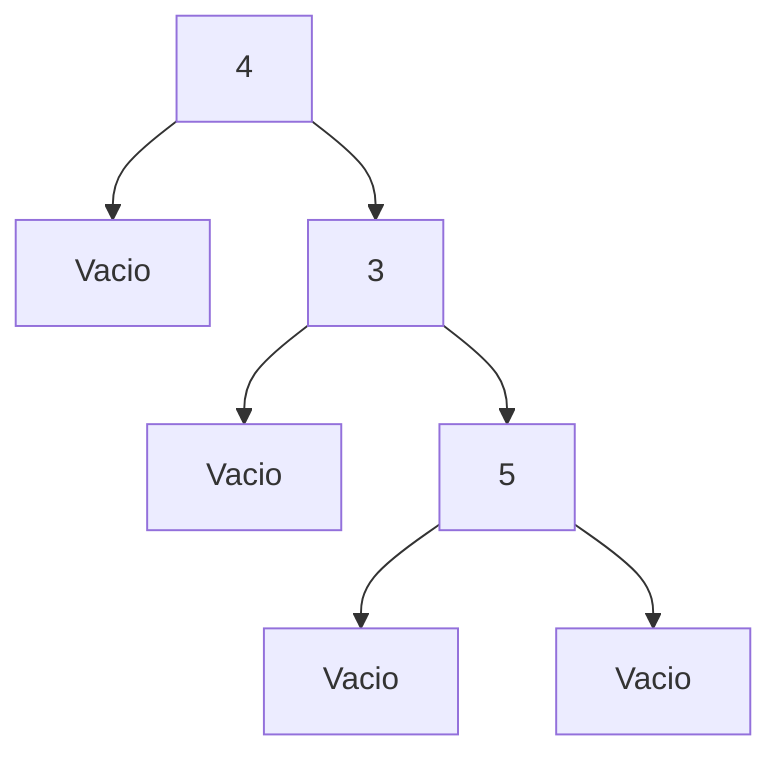

# Objetivo de la práctica 6
- Empezar a utilizar árboles binarios en Haskell
- Trabajar sobre árboles binarios 
- Definir funciones recursivas en árboles binarios
- Aprender sobre el uso de mermaid 

## Comentarios y tiempo en realizar
Siento que es algo más complejo trabajar los árboles binarios en Haskell, porque a veces me llego a confundir entre el diagrama de un árbol a como se representa en el lenguaje.
Aproximadamente me tardé unas 5 horas repartidas en varios días para realizar la práctica completa, además que las últimas dos funciones las sentí algo complicadas de implementar.

### Árboles en mermaid 
1- AB 4 (Vacio) (AB 3 Vacio Vacio)
```mermaid
graph TB
A1 [4] --> B1[Vacio]
A1 --> C1[3]
C1 --> D1[Vacio]
C1 --> E1[Vacio]
```

2- AB 4 Vacio (AB 3 Vacio (AB 5 Vacio Vacio))


3- AB 3 (AB 7 (AB 12 Vacio Vacio) Vacio) (AB 6 ( AB 11 Vacio Vacio) (AB 10 Vacio Vacio)
```mermaid
graph TB
A3[3] --> B3[7]
A3 --> C3[6]
B3 --> D3[12]
B3 --> E3[Vacio]
D3 --> F3[Vacio]
D3 --> G3[Vacio]
C3 --> H3[11]
C3 --> I3[10]
H3 --> J3[Vacio]
H3 --> K3[Vacio]
I3 --> L3[Vacio]
I3 --> M3[Vacio]